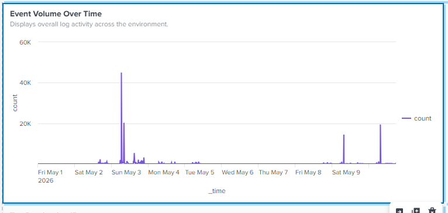
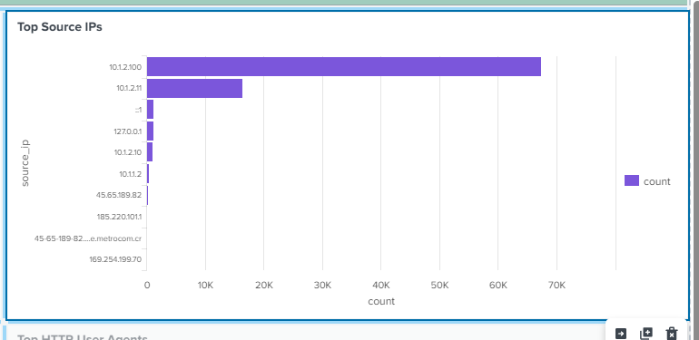
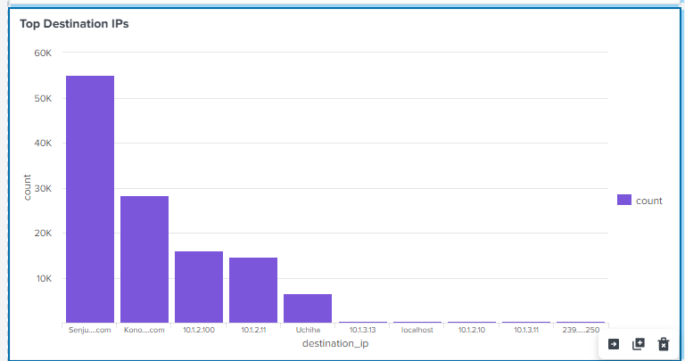
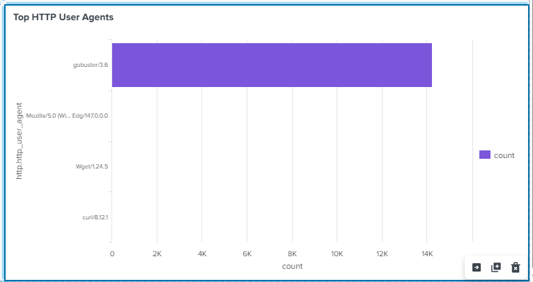
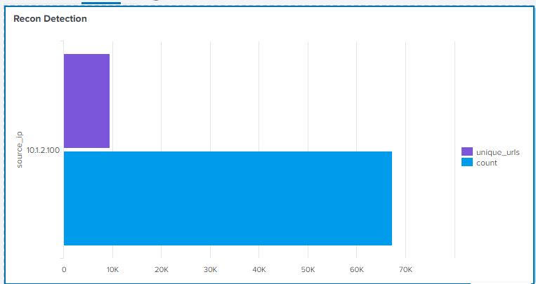
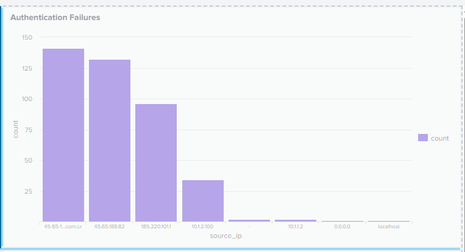
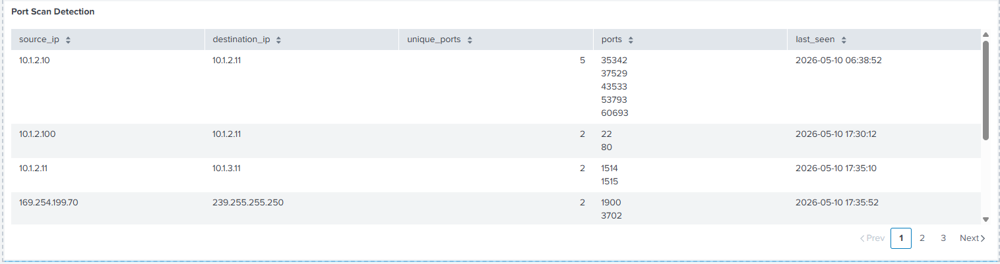

# 🛡️ Splunk SOC Overview Dashboard

## 📌 Overview

This chapter contains a custom SOC dashboard created in Splunk as part of my personal cybersecurity lab.

The objective of this dashboard is to simulate a real SOC analyst monitoring environment by visualizing:

- Log activity across the infrastructure
- Top communicating hosts
- HTTP activity
- Authentication failures
- Reconnaissance attempts
- Port scanning behavior
- Triggered alerts

The dashboard was built using multiple data sources including:

- Splunk Universal Forwarders
- Suricata IDS
- Windows Event Logs
- Linux authentication logs
- Apache HTTP logs

---

# 🧱 Environment

## 🔹 SOC Infrastructure

| Component | Purpose |
|---|---|
| Splunk Enterprise | SIEM & Log Analysis |
| Suricata | Network IDS |
| Apache | Web Services |
| Windows AD | Authentication |
| Kali Linux | Attack Simulation |
| Ubuntu Servers | Log Generation |

---

# 🖥️ Dashboard Layout

The dashboard is divided into two operational tabs:

## 🔹 SOC Overview
General visibility and infrastructure monitoring.

## 🔹 Detection & Threat Hunting
Security detections and attacker behavior analysis.

---

# 📊 Dashboard Panels

---

# 1️⃣ Triggered Alerts

Displays the number of triggered detections identified within the selected time range.

## SPL

```spl
index=_internal sourcetype=scheduler status=success savedsearch_name=*
| stats count by savedsearch_name
| sort - count
```

---

# 2️⃣ Event Volume Over Time

Displays overall log activity across the environment.

## SPL

```spl
index=*
| timechart span=5m count
```

---

# 3️⃣ Top Source IPs

Identifies the most active source IP addresses generating events.

## SPL

```spl
index=*
| eval source_ip=coalesce(src_ip, src, source_ip)
| stats count by source_ip
| sort - count
| head 10
```

---

# 4️⃣ Top Destination IPs

Displays the most targeted destination hosts across the environment.

## SPL

```spl
index=*
| eval destination_ip=coalesce(dest_ip, dest, destination_ip)
| stats count by destination_ip
| sort - count
| head 10
```

---

# 5️⃣ Top HTTP User Agents

Shows the most commonly observed HTTP User Agents from Suricata HTTP logs.

Useful for identifying:
- Browsers
- Automated tools
- Enumeration activity
- Suspicious scanners

## SPL

```spl
index=suricata event_type=http
| stats count by http.http_user_agent
| sort - count
| head 10
```

---

# 6️⃣ Recon Detection

Detects potential reconnaissance or directory enumeration activity by identifying clients requesting a large number of unique URLs.

## SPL

```spl
index=* 
| eval source_ip=coalesce(src_ip,src)
| eval uri=coalesce(uri,http.url,url)
| stats dc(uri) as unique_urls count by source_ip
| where unique_urls > 50
| sort - unique_urls
```

## Detection Logic

This detection is useful for identifying:
- Gobuster
- Dirb
- FFUF
- Web enumeration tools
- Aggressive crawling behavior

---

# 7️⃣ Authentication Failures

Detects failed authentication attempts across multiple log sources.

## SPL

```spl
index=* ("failed password" OR EventCode=4625 OR "authentication failure")
| eval source_ip=coalesce(src_ip,Source_Network_Address,src,rhost,clientip)
| where isnotnull(source_ip)
| stats count by source_ip
| sort - count
```

## Detection Logic

Useful for identifying:
- SSH brute force attacks
- Windows authentication failures
- Password spraying attempts
- Invalid login activity

---

# 8️⃣ Port Scan Detection

Detects hosts communicating with multiple destination ports, commonly associated with reconnaissance or network scanning activity.

## SPL

```spl
index=suricata event_type=flow
| eval source_ip=coalesce(src_ip,src)
| eval destination_ip=coalesce(dest_ip,dest)
| eval destination_port=coalesce(dest_port,dpt)
| stats dc(destination_port) as unique_ports values(destination_port) as ports latest(_time) as last_seen by source_ip destination_ip
| sort - unique_ports
| eval last_seen=strftime(last_seen,"%Y-%m-%d %H:%M:%S")
```

## Detection Logic

This panel helps identify:
- Nmap scans
- Service discovery activity
- Lateral movement reconnaissance
- Internal network enumeration

---

# 🔍 Example Use Cases

## Reconnaissance Detection

Identify hosts generating excessive web requests:

- Gobuster scans
- Hidden directory enumeration
- Web crawling

---

## Authentication Monitoring

Monitor authentication failures from:
- Linux systems
- Windows Event Logs
- SSH services

---

## Network Scanning Detection

Detect:
- Port scans
- Internal enumeration
- Lateral movement behavior

---

# 🧠 Skills Demonstrated

- Splunk Dashboard Development
- SPL (Splunk Processing Language)
- Threat Hunting
- Detection Engineering
- SOC Monitoring
- IDS Log Analysis
- Authentication Analysis
- Reconnaissance Detection
- Port Scan Detection
- Log Normalization

---

# 🛠️ Technologies Used

| Technology | Purpose |
|---|---|
| Splunk Enterprise | SIEM |
| Suricata | IDS |
| Apache | Web Server |
| Kali Linux | Offensive Simulation |
| Windows Server | Active Directory |
| Ubuntu | Linux Logging |
| Sysmon | Endpoint Telemetry |

---

# 📷 Dashboard Preview

## SOC Overview


---

## Detection & Threat Hunting



---

## Event Volume Over Time



---

## Top Source IPs



---

## Top Destination IPs



---

## Top HTTP User Agents



---

## Authentication Failures



---

## Port Scan Detection



---

# 📚 Author

Jordan Moran  
Cybersecurity Enthusiast | Threat Detection | SOC Analyst | Splunk Labs
