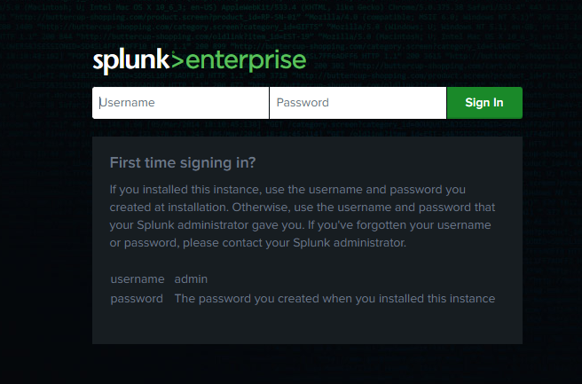

# 📘 Splunk Enterprise Installation on Linux

This section provides step-by-step instructions to install **Splunk Enterprise** on Linux systems. You can install it using `.tgz`, `.rpm`, or `.deb` packages depending on your distribution.

---

## 🔧 Lab VM Setup (Hyper-V)

For this lab, we are using a dedicated virtual machine running **Ubuntu Server 22.04 LTS** inside **Hyper-V**.

### ✅ Recommended VM Settings

| Setting         | Value                |
|----------------|----------------------|
| VM Name        | SplunkLab            |
| Generation     | 2                    |
| RAM            | 8 GB (Dynamic Memory)|
| vCPU           | 2                    |
| Disk Size      | 100 GB (VHDX)        |
| Network        | External Switch (NAT or Bridged) |
| OS             | Ubuntu 22.04.4 LTS   |

### ▶️ Create VM with PowerShell (Optional)

You can use the following PowerShell script to automatically provision the VM in Hyper-V:

```powershell
# Create-Linux-VM.ps1

$VMName = "SplunkLab"
$VHDPath = "D:\HyperV\$VMName\$VMName.vhdx"
$ISOPath = "D:\ISOs\ubuntu-22.04.4-live-server-amd64.iso"

New-VM -Name $VMName -MemoryStartupBytes 8GB -Generation 2 -NewVHDPath $VHDPath -NewVHDSizeBytes 100GB -BootDevice CD

Set-VMDvdDrive -VMName $VMName -Path $ISOPath
Add-VMNetworkAdapter -VMName $VMName -SwitchName "ExternalSwitch"
Set-VMProcessor -VMName $VMName -Count 2
Set-VM -Name $VMName -AutomaticStopAction ShutDown
```

> 💡 After creation, boot the VM, install Ubuntu Server manually, and assign a static IP.

---

## 📦 Installation via `.tgz` (Generic Tarball)

### 🔧 Prerequisites
- Create a non-root user (optional, but recommended):
  ```bash
  sudo useradd splunk
  ```
- Ensure your system has enough disk space and `bash` is the default shell.

### 📥 Download & Install
```bash
cd /opt
sudo tar xvzf splunk-<version>-Linux-x86_64.tgz
```

### ▶️ Start Splunk
```bash
cd /opt/splunk/bin
sudo ./splunk start --accept-license
```

---

## 📦 Installation via `.rpm` (RedHat, CentOS)

### 📥 Install RPM
```bash
sudo rpm -i splunk-<version>.rpm
```

### ▶️ Start & Enable Boot
```bash
sudo /opt/splunk/bin/splunk start --accept-license
sudo /opt/splunk/bin/splunk enable boot-start
```

---

## 📦 Installation via `.deb` (Debian, Ubuntu)

### 📥 Install DEB
```bash
sudo dpkg -i splunk-<version>.deb
```

### ▶️ Start & Enable Boot
```bash
sudo /opt/splunk/bin/splunk start --accept-license
sudo /opt/splunk/bin/splunk enable boot-start
```

---

## 🧪 Post-Installation Tasks

| Task                          | Command                                                                 |
|-------------------------------|-------------------------------------------------------------------------|
| Set Admin Password            | Prompted at first start                                                 |
| Status Check (Debian)        | `dpkg --status splunk`                                                  |
| List Installed Packages       | `dpkg --list` or `rpm -qa | grep splunk`                               |
| Validate Installation         | `/opt/splunk/bin/splunk validate files`                                 |
| Access Web Interface          | `http://<host>:8000`                                                    |

```



---

> 📘 **Note:** For automated installations or advanced configurations (e.g., non-root users, containerized environments), refer to the official [Splunk Installation Manual](https://docs.splunk.com/Documentation/Splunk/latest/Installation).
