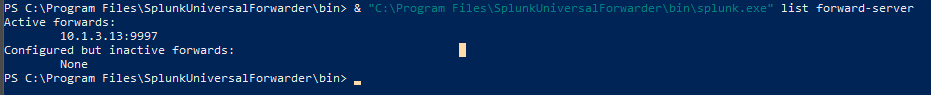
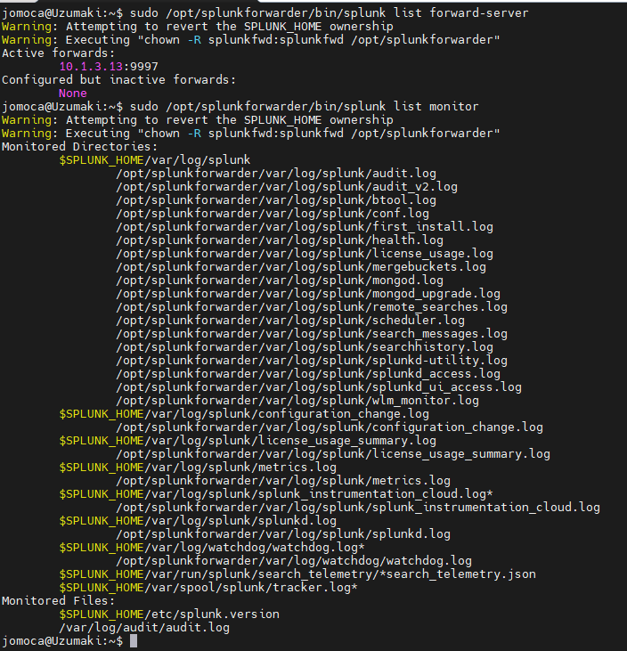
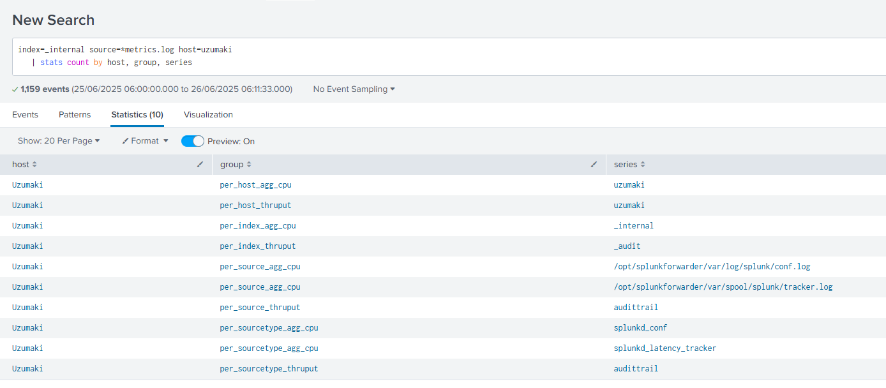

# 🔰 Splunk Universal Forwarder – Installation & Verification Guide

This guide walks through installing the **Splunk Universal Forwarder (UF)** on both Windows and Linux hosts in the lab, forwarding data to the Splunk server **10.1.3.12:9997**, and validating that events arrive successfully.

---

## 1️⃣ Download the Installer

| OS       | Package (9.4.3) | Download Command / Link |
|----------|-----------------|-------------------------|
| **Windows x64** | `splunkforwarder-9.4.3-237ebbd22314-x64-release.msi` | <https://download.splunk.com/products/universalforwarder/releases/9.4.3/windows/> |
| **Linux x64**   | `splunkforwarder-9.4.3-237ebbd22314-linux-x86_64.tgz` | `curl -O https://download.splunk.com/products/universalforwarder/releases/9.4.3/linux/splunkforwarder-9.4.3-237ebbd22314-linux-x86_64.tgz` |

Replace **`237ebbd22314`** with the actual build ID from Splunk’s download page.

---

## 2️⃣ Windows Installation (Silent)

```powershell
msiexec /i splunkforwarder-9.4.3-*-x64-release.msi ^
  AGREETOLICENSE=Yes ^
  RECEIVING_INDEXER="10.1.3.12:9997" ^
  WINEVENTLOG_SEC_ENABLE=1 ^
  WINEVENTLOG_SYS_ENABLE=1 ^
  WINEVENTLOG_APP_ENABLE=1 ^
  PERFMON=cpu,memory ^
  /quiet /norestart
```

### Expected Output / Checks

1. **Service Running**

   ```powershell
   Get-Service SplunkForwarder
   ```

   ```
   Status   Name               DisplayName
   ------   ----               -----------
   Running  SplunkForwarder    SplunkForwarder
   ```

2. **Forward-server Status**

   ```powershell
   "C:\Program Files\SplunkUniversalForwarder\bin\splunk.exe" list forward-server
   ```

   ```
   Active forwards:
       10.1.3.12:9997
           state=enabled Active=true
   ```

3. **Screenshot:**



---

## 3️⃣ Linux Installation (Ubuntu 22.04)

```bash
# 1. Extract & move
tar -xzvf splunkforwarder-9.4.3-*-linux-x86_64.tgz -C /opt

# 2. Enable boot-start, accept the license
sudo /opt/splunkforwarder/bin/splunk enable boot-start -user splunk --accept-license --answer-yes

# 3. Configure Receiver
sudo /opt/splunkforwarder/bin/splunk add forward-server 10.1.3.12:9997
sudo /opt/splunkforwarder/bin/splunk add monitor /var/log/auth.log
sudo /opt/splunkforwarder/bin/splunk restart
```

### Expected Output / Checks

```bash
sudo /opt/splunkforwarder/bin/splunk list forward-server
```

```
Active forwards:
    10.1.3.12:9997
        state=enabled Active=true
```



---

## 4️⃣ Splunk Side Verification

1. **_internal Index Check**

   SPL:

   ```spl
   index=_internal source=*metrics.log host=<forwarder-host>
   | stats count by host, group, series
   ```

   📌 **What does this query verify?**

   This SPL searches the `_internal` index where Splunk stores internal performance logs.
   It shows whether the Universal Forwarder is communicating with the indexer and sending monitoring metrics.

   - **`host`**: the name of the forwarder machine (e.g., `Uzumaki`)
   - **`group`**: type of metric (e.g., `per_host_agg_cpu`, `per_index_thruput`)
   - **`series`**: specific monitored input or component (e.g., `_internal`, `audittrail`, log file paths)

   ✅ If you see multiple rows with non-zero event counts, your forwarder is active and properly sending telemetry.

   📸 Screenshot:




   > *Tip: This query is also useful for building dashboards to monitor forwarder health.*


---

## 5️⃣ Troubleshooting Tips

| Symptom                       | Fix / Check |
|-------------------------------|-------------|
| `Active=false` on UF          | Port blocked (9997/TCP) or wrong IP. Test with `telnet 10.1.3.12 9997`. |
| No events in `_internal`      | Time sync issues – ensure NTP is configured. |
| Windows logs not ingested     | Verify EventLog channels enabled; restart UF service. |
| Linux permission errors       | Run UF as root or grant read to log paths. |

---

## ✅ Completion Criteria

- **Both forwarders list connection `Active=true`.**  
- **Events from each host visible in Splunk GUI.**  


```

Lets Hunt! 🎯
