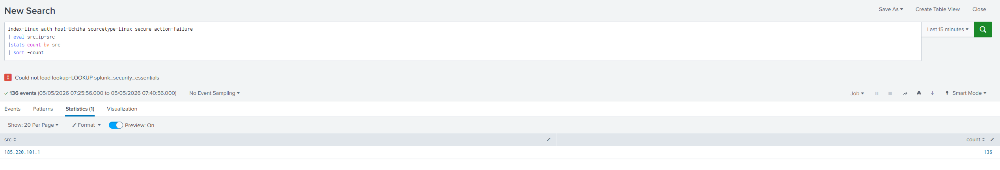
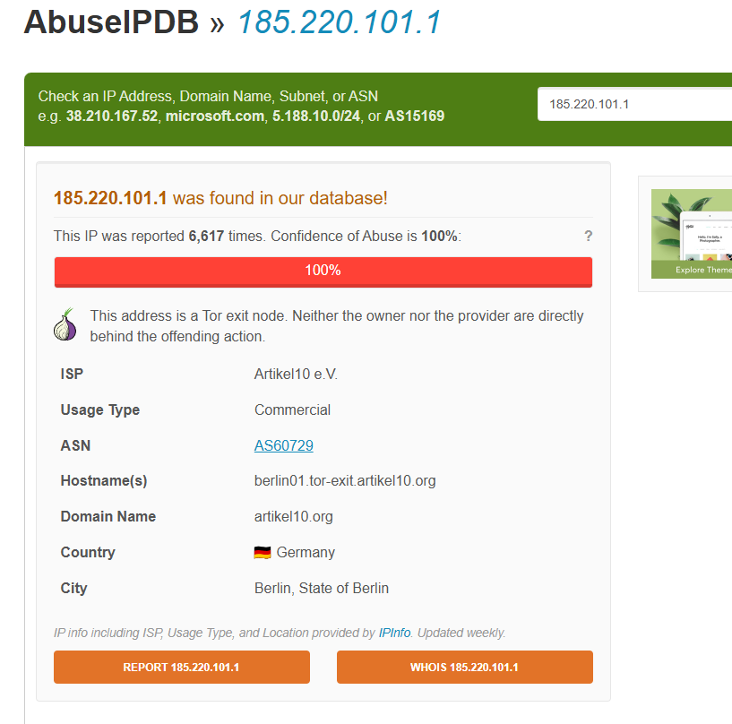
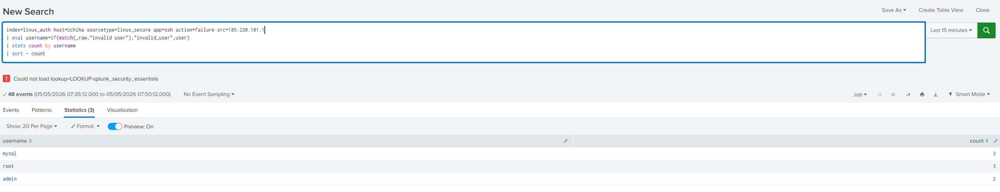
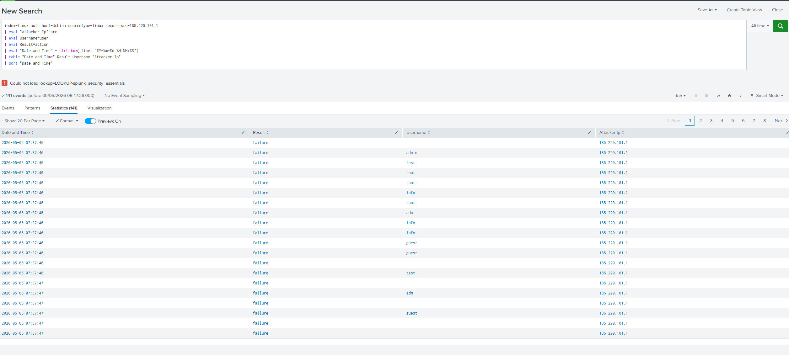
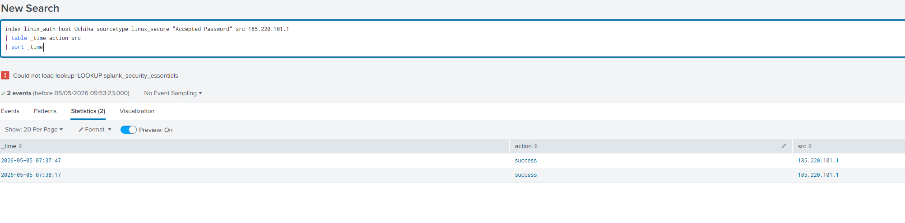

🔎 SSH Brute Force Attack Investigation
---

## 📌 Objective

The objective of this investigation is to analyze suspicious SSH authentication activity detected on the server **Uchiha** following a triggered security alert.  

The analysis aims to identify the source of the attack, determine whether the activity resulted in unauthorized access, and assess the potential impact on the system.

---

## 🧠 Intial Hypohesis

While reviewing authentication logs, I observed a high number of failed SSH login attempts.  

This raised the following questions:

- Who initiated the attack?
- Which assest was targeted?  
- when did the activity occur?  
- How many attempts were performed? 
- Was the attack succesful

---

## 🚨 1. Detection of Failed SSH Logins

### 📡 Detection Query

To identify abnormal authentication activity, the following search was performed:

```spl
index=linux_auth host=Uchiha sourcetype=linux_secure app=ssh action=failure
| stats count by src
| sort - count
```

### 📸 Evidence



### 🧾 Result

- **Source IP:** 185.220.101.1  
- **Failed attempts:** 136  

---

## 🌍 2. Threat Intelligence Enrichment

The suspicious IP was validated using threat intelligence (AbuseIPDB).

### 📸 Evidence



### 🧾🧠 Analysis

The use of a TOR exit node suggests:

- Attempt to anonymize attacker origin
- Common technique in automated attacks and brute force campaigns

---

## 3. 👤 Targeted Usernames Analysis

To identify which accounts were targeted:

```spl
index=linux_auth host=Uchiha sourcetype=linux_secure app=ssh action=failure src=185.220.101.1
| eval username=if(match(_raw,"invalid user"),"invalid_user",user)
| stats count by username
| sort - count
```

### 📸 Evidence



### 🧾 Result

The attacker attemped authentication against the following accounts:

- admin  
- root  
- multiple invalid users

### 🧠 Analysis

- Presence of valid usernames (e.g., admin, root) indicates targeted brute force
- Invalid usernames suggest username enumeration behavior
---

## ⏱ 4. Attack Timeline Analysis

To understand attack behavior over time:

```spl
index=linux_auth host=Uchiha sourcetype=linux_secure src=185.220.101.1
| eval src_ip=src
| eval username=user
| eval result=action
| eval "Date and Time" = strftime(_time, "%Y-%m-%d %H:%M:%S")
| table "Date and Time" result username src_ip
| sort "Date and Time"
```

### 📸 Evidence



### 🧠 Analysis

- High-frequency attempts within seconds  
- This indicates automated attack behavior (likely brute force tool)  

---

## 🔐 5. Detection of Successful Authentication

To verify if the attack succeeded:

```spl
index=linux_auth host=Uchiha sourcetype=linux_secure "Accepted password" src=185.220.101.1
| table _time action user src
```

### 📸 Evidence



### ✅ Findings

- Successful login detected  
- **Compromised account:** `admin`  

---

## 6. ⚠️ Root Cause Analysis

- There was a weak or guessable password for `admin`  
- SSH was exposed to external network
- There wasn o brute force protection such fail2ban, rate limiting, etc.  
- No MFA or key-based authentication enforced on the server

---

## ⏱ Technical Timeline

| Time       | Event                              |
|-----------|------------------------------------|
| 07:37:xx  | Multiple failed SSH attempts       |
| 07:37:47  | Successful login detected          |
| Post-login| Unauthorized access confirmed      |

---

## 🚨 Security Impact

- Compromise of valid user credentials
- Unauthorized SSH access to critical system
- Potential risk of:
  - Privilege escalation
  - Persistence
  - Lateral movement
  - Data exfiltration 

---

## 🧬 MITRE ATT&CK Mapping

The observed activity aligns with the following MITRE ATT&CK techniques:

- **T1110 – Brute Force**  
  The attacker performed multiple authentication attempts against the SSH service.

- **T1110.001 – Password Guessing**  
  Common usernames such as `admin` and `root` were targeted using likely dictionary-based attempts.

- **T1078 – Valid Accounts**  
  The attacker successfully authenticated using valid credentials, gaining unauthorized access.

---

## 🛡️ Response Actions

- Identified compromised account (`admin`)  
- Validated source IP reputation  
- Confirmed successful login event  
- Analyzed authentication logs  

---

## 🔄 Recommendations

- Reset compromised credentials immediately  
- Disable SSH password authentication  
- Enable SSH key-based authentication  
- Implement brute force protection (fail2ban)  
- Restrict SSH access via firewall  
- Monitor for post-compromise activity  

---

## 📚 Lessons Learned

- Brute force attacks can escalate quickly to compromise  
- Exposure of SSH without controls is high risk  
- Threat intelligence enrichment adds critical context  
- Detection must include both failure AND success correlation  
