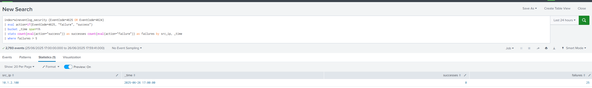
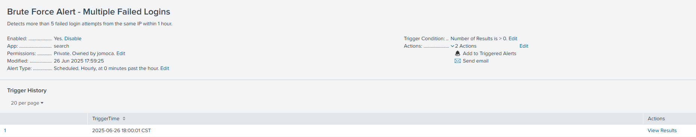

# Brute Force Detection Lab on Windows (Splunk SIEM)

## 🧠 **Overview**

This hands-on lab demonstrates how to simulate and detect a brute force attack on a Windows environment using Splunk SIEM. The objective is to:

Recreate a common brute force attack scenario via RDP using a Kali Linux attacker.

Prepare the Windows environment (Domain Controller and endpoint) to properly audit and log login attempts.

Use Splunk to collect Windows Security Events and create a detection rule that identifies multiple failed logon attempts from the same source.

Set up a Splunk alert to notify when suspicious behavior occurs.

This lab provides security analysts and defenders with a step-by-step guide to reproduce a real-world attack pattern and improve detection capabilities for credential-based attacks.

## 🛠️ Step 1: Enable Logon Auditing via GPO

On **Konoha (Domain Controller)**:

1. Press `Win + R`, type `gpmc.msc`, and press Enter.
2. Navigate to:

   ```
   Forest > Domains > seclabjmc.com
   ```
3. Right-click `seclabjmc.com` → **Create a GPO in this domain, and Link it here...**

   * **Name**: `GPO - Audit Logon Events`
4. Right-click the new GPO → **Edit**
5. Navigate to:

   ```
   Computer Configuration >
   Policies >
   Windows Settings >
   Security Settings >
   Advanced Audit Policy Configuration >
   Audit Policies >
   Logon/Logoff
   ```
6. Enable the following subcategories:

| Subcategory         | Setting          |
| ------------------- | ---------------- |
| Audit Logon         | Success, Failure |
| Audit Logoff        | Success, Failure |
| Audit Special Logon | Success          |

---

## 🔄 Step 2: Apply GPO in the Target (Senju)

Open PowerShell or CMD as Administrator on **Senju**:

```bash
gpupdate /force
auditpol /get /category:"Logon/Logoff"
```

You should see:

```
Logon                                   Success and Failure
Logoff                                  Success and Failure
Special Logon                           No Auditing
```

---

## 🎯 Step 3: Simulate Brute Force from Kali Linux

On **Kali Linux**:

```bash
hydra -l jomoca -P passwords.txt -t 4 -f -o result.txt rdp://10.1.1.2
```

---

## 🔍 Step 4: Detection in Splunk

Run the following SPL in Splunk Search:

```spl
index=wineventlog_security (EventCode=4625 OR EventCode=4624)
| eval action=if(EventCode=4625, "failure", "success")
| bucket _time span=1h
| stats count(eval(action="success")) as successes count(eval(action="failure")) as failures by src_ip, _time
| where failures > 5
```

You should see something like:





---

## 📣 Step 5: Create Alert in Splunk

1. In the Search App, run the SPL query above.
2. Click **Save As > Alert**.
3. Configure:

   * **Title**: `Brute Force Alert - Multiple Failed Logins`
   * **Description**: Detects more than 5 failed login attempts from the same IP within 1 hour.
   * **Permissions**: (App or Global)
   * **Trigger**:

     * **When**: `Number of results > 0`
     * **Trigger**: `Once per result`
   * **Time Range**: `Run every 60 minutes`
   * **Actions**:

     * ✅ Send email
     * ✅ Add to Triggered Alerts

---

## ✅ Step 6: Validate the Alert

1. Re-run the `hydra` brute force from Kali.
2. Wait until the alert is scheduled to run (or execute manually).
3. Go to **Activity > Triggered Alerts** and confirm it appears.
4. Check the **email inbox** at `socseclabjmc@gmail.com`.




---

© 2025 Jordan Moran Cabello — Splunk SIEM Lab

> This lab is part of a Threat Detection series for GitHub portfolio
