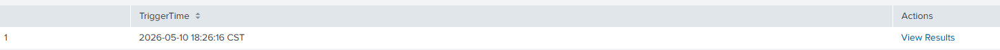
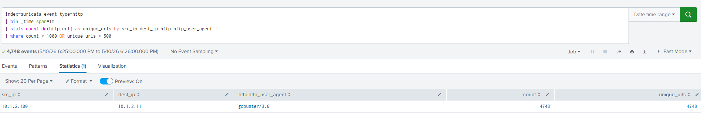
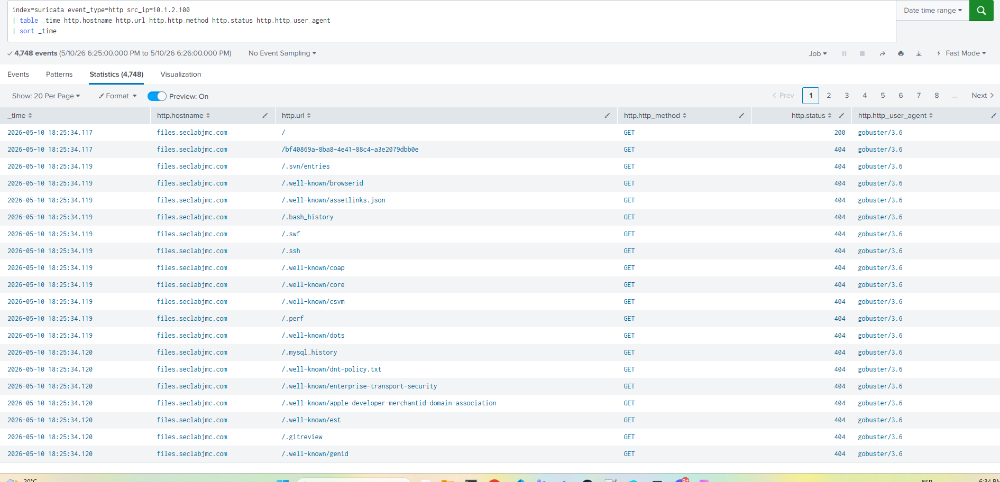
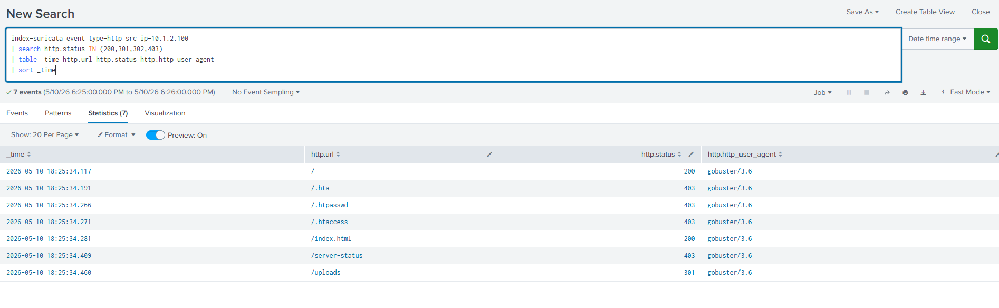
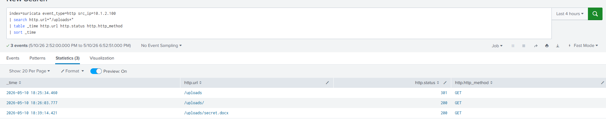

# 🔎 Web Enumeration Investigation

---

## 📌 Objective

The objective of this investigation is to analyze suspicious web enumeration activity detected after a security alert was triggered on the internal file server.

The analysis aims to identify the source of the activity, determine whether valid resources were discovered, verify whether files were accessed, and assess the potential impact on the environment.

---

## 🧠 Initial Hypothesis

While reviewing HTTP logs, I observed a high number of requests targeting multiple URLs within a very short period of time.

This raised the following questions:

- Who initiated the activity?
- Which web server was targeted?
- Was the activity automated?
- Were valid directories discovered?
- Were internal files accessed or downloaded?
- Did the activity result in data exposure?

---

## 🚨 1. Detection of Web Enumeration Activity

### 📡 Detection Query

```spl
index=suricata event_type=http
| bin _time span=1m
| stats count dc(http.url) as unique_urls by src_ip dest_ip http.http_user_agent
| where count > 1000 OR unique_urls > 500
```

### 📸 Evidence





---

## 🌐 2. Analysis of Requested URLs

### 📡 Investigation Query

```spl
index=suricata event_type=http src_ip=10.1.2.100
| table _time http.hostname http.url http.http_method http.status http.http_user_agent
| sort _time
```

### 📸 Evidence



### 🧠 Analysis

The logs show:

- Multiple sequential HTTP GET requests
- Enumeration of hidden and sensitive paths
- High request frequency within seconds
- User-Agent identified as `gobuster/3.6`

This behavior strongly indicates automated web enumeration activity.

---

## 🔍 3. Identification of Valid Resources

### 📡 Investigation Query

```spl
index=suricata event_type=http src_ip=10.1.2.100
| search http.status IN (200,301,302,403)
| table _time http.url http.status http.http_user_agent
| sort _time
```

### 📸 Evidence



### 🧠 Analysis

The investigation confirmed that the `/uploads` directory existed and returned useful responses to the attacker.

---

## 📂 4. Exposed Directory Investigation

### 📡 Investigation Query

```spl
index=suricata event_type=http src_ip=10.1.2.100
| search http.url="/uploads*"
| table _time http.url http.status http.http_method
| sort _time
```

### 📸 Evidence



### 🧠 Analysis

The logs show:

- Initial request to `/uploads`
- HTTP `301` redirect response
- Subsequent successful access to `/uploads/`
- Successful HTTP `200 OK` response for `/uploads/secret.docx`

This confirms that:

- The attacker successfully identified the exposed directory
- Directory listing was enabled on the Apache server
- Internal files hosted in the directory were accessible
- At least one file was successfully downloaded

---

## ⏱ Technical Timeline

| Time | Event |
|---|---|
| 18:25:34 | Automated web enumeration activity detected |
| 18:25:34 | `/uploads` identified |
| 18:26:03 | `/uploads/` successfully accessed |
| 18:39:14 | `secret.docx` successfully downloaded |

---

## ⚠️ Root Cause Analysis

- Directory listing was enabled on the Apache server
- Sensitive files were stored inside a publicly accessible directory
- No access restrictions were configured for `/uploads/`
- The server exposed useful HTTP responses aiding enumeration
- No WAF or request throttling protections were implemented

---

## 🚨 Security Impact

- Exposure of internal web resources
- Unauthorized discovery of sensitive directories
- Unauthorized file access
- Potential data exfiltration
- Increased attack surface visibility

---

## 🧬 MITRE ATT&CK Mapping

- **T1595 – Active Scanning**
- **T1083 – File and Directory Discovery**
- **T1005 – Data from Local System**
- **T1041 – Exfiltration Over C2 Channel**

---

## 🛡️ Response Actions

- Identified malicious source IP activity
- Confirmed automated enumeration behavior
- Validated exposed directory listing
- Confirmed unauthorized file access
- Analyzed HTTP logs and attacker behavior timeline

---

## 🔄 Recommendations

- Disable Apache directory listing immediately
- Restrict access to sensitive directories
- Implement Web Application Firewall (WAF) protections
- Monitor for excessive HTTP enumeration activity
- Enable rate limiting and request throttling
- Remove sensitive files from publicly accessible locations
- Continue monitoring for additional post-enumeration activity

---

## 📚 Lessons Learned

- Web enumeration can quickly lead to sensitive data exposure
- HTTP response codes provide valuable feedback to attackers
- Directory listing significantly increases attack surface visibility
- Correlating discovery and file access events is critical during investigations
